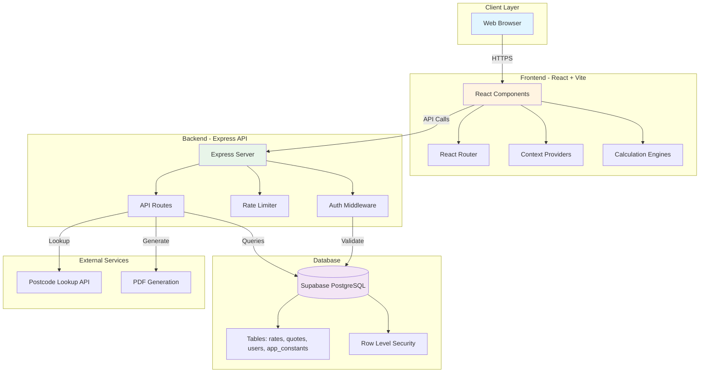
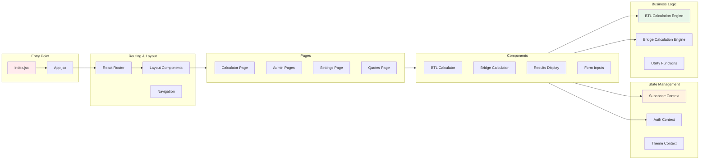
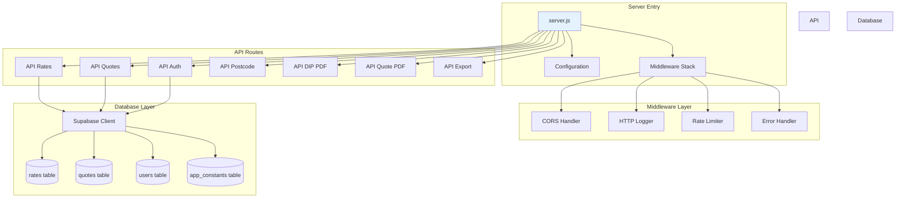
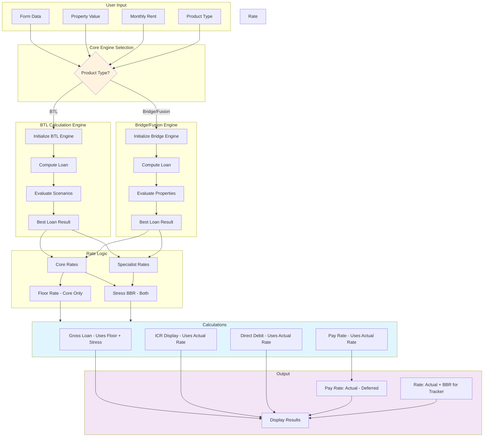
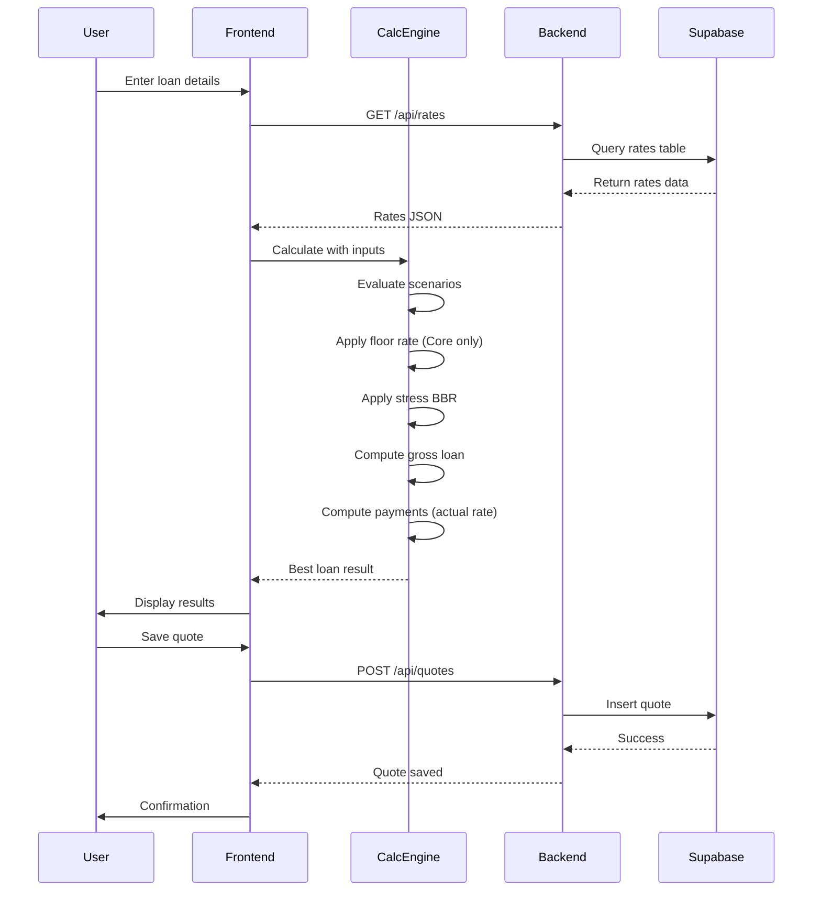
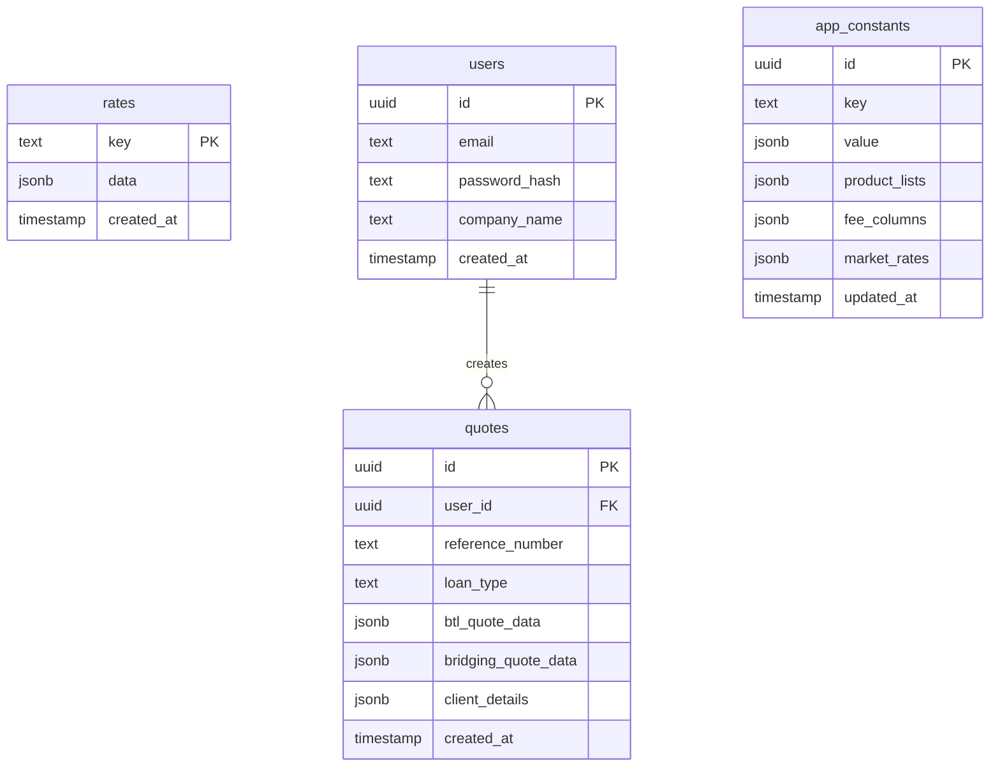
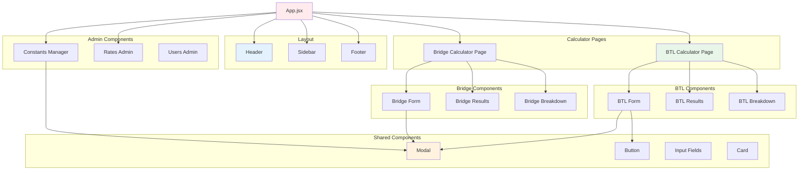
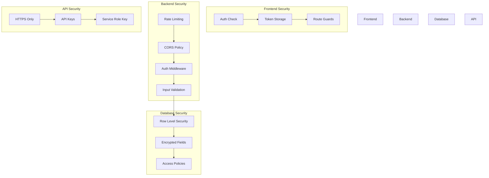
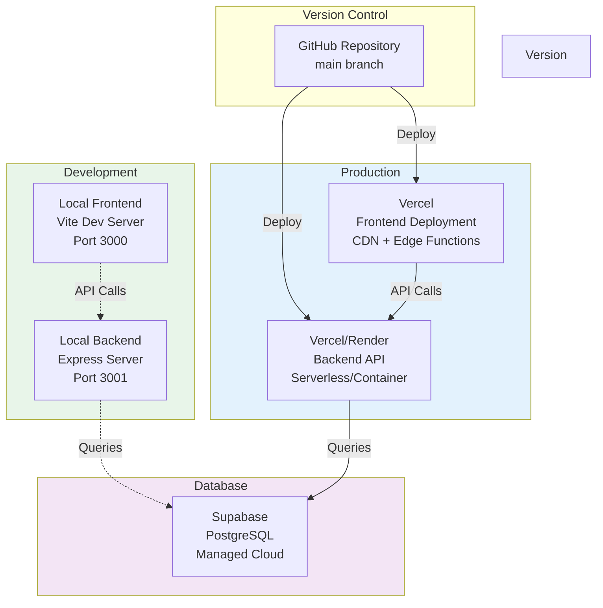

# BTL Calculator - System Architecture

## High-Level System Architecture

## Frontend Architecture

## Backend API Architecture

## Calculation Engine Architecture

## Data Flow Diagram

## Database Schema

## Component Hierarchy

## Security Architecture

## Deployment Architecture

---

## Key Architecture Principles

### 1. **Separation of Concerns**
- Frontend handles UI and user interaction
- Backend handles API, authentication, and data access
- Calculation engines are pure business logic (no UI)

### 2. **Rate Calculation Rules**
- **Floor Rate**: Applied ONLY to core products for gross loan calculation
- **Stress BBR**: Applied to BOTH core and specialist products for gross loan calculation
- **Actual Rate**: Used for all payment calculations and display
- **Pay Rate Display**: Always shows `actual rate - deferred rate` (no floor)

### 3. **Security Layers**
- Frontend: Route guards, auth context
- Backend: Rate limiting, CORS, auth middleware
- Database: Row Level Security (RLS), encrypted fields
- Communication: HTTPS only, token-based auth

### 4. **Scalability**
- Stateless API design
- Client-side calculation engines (reduces server load)
- Database connection pooling
- Rate limiting prevents abuse

### 5. **Maintainability**
- Modular component structure
- Separate calculation engines per product type
- Centralized configuration (app_constants)
- Environment-based configuration
